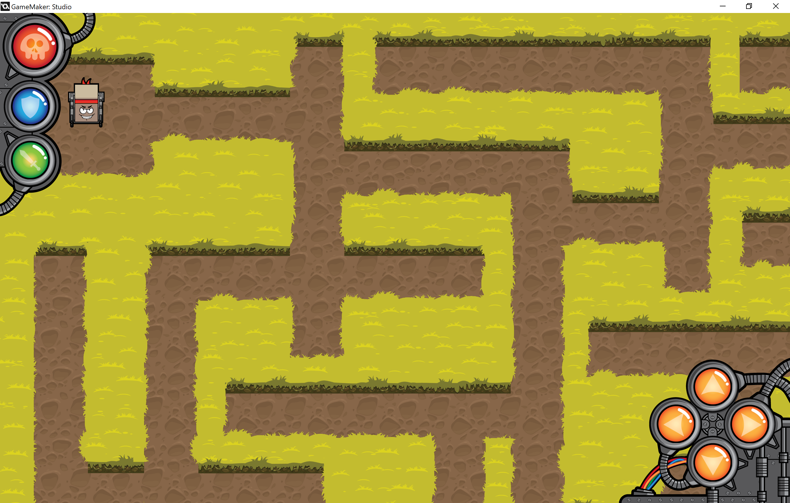
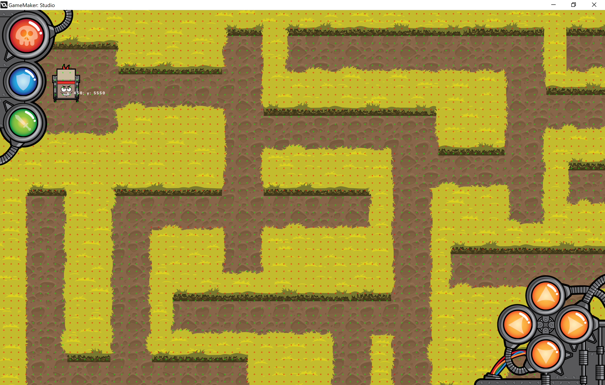
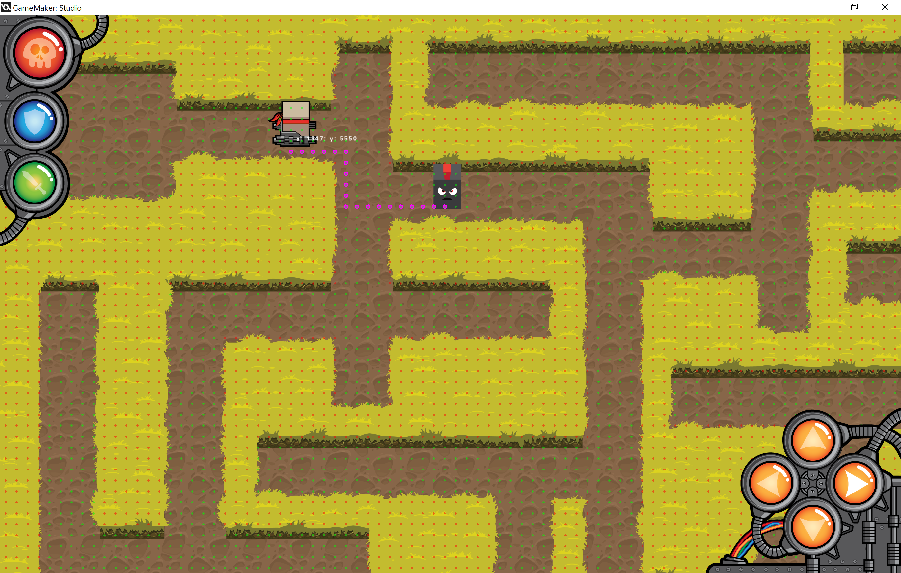

## Amazing; an hobbyists approach to pathfinding
### 2018-11-17

[Amazing](https://github.com/Devilly/amazing) was the name of a game Bas Goverde and I were going to create. It was our second attempt at creating a game and wanted to make it for Android. We had awesomeness in mind: top-down camera angle, gunfire, enemy AI and even a versus mode with multiple real people battling each other.

The enemy AI was going be coded by hand and the first hurdle would be letting the enemy move. This was for me, without any experience with pathfinding algorithms and also new to GameMaker: Studio 1.4 which we used for creating the game, a big challenge.

To give some context below a screenshot of the game running on Windows.

The level shown shows the structure of a maze and this would be true for all levels. (What's in a name?) Brown is the ground the player can walk on. Green are the impenetrable bushes, the walls of the maze. While the level was a combination of several images being layed on top of each other and each image, because of performance reasons, being loaded as a lot of small sprites stitched together the result can be seen as a single big image. 

Aside from this image we also had hitbox images. These determined exactly where on a level any of the (AI) players were allowed to walk. In theory one could create walking logic based on these pixel precise images but that would not be very performant. Therefore we created a grid with a much lower granularity. Each cell in the grid indicated whether one was allowed to walk there or not. To make testing easier we added a debug mode which showed for each cell a green dot when walking was allowed there and a red dot if it wasn't.

Then we implemented a naive A* algorithm after learning more about the subject from [this](https://www.redblobgames.com/pathfinding/a-star/introduction.html) blog post. This algorithm can calculate a walkable path from point A to point B where both A and B reside on walkable grid cells. In the debug mode this is visualised with pink dots.

In below image A is the enemy and B is the player.

The algorithm was still really inefficient when we got this working. One could notice more and more slowdown in the frames per second (FPS) the greater the distance between the enemy and the player became. We wanted to improve on this and had quite some options in mind...

But then we decided to drop the project, not because of technicalities like this, but because of difficulties with the grapical style. It was a shame. Yet, the project was a good learning school.