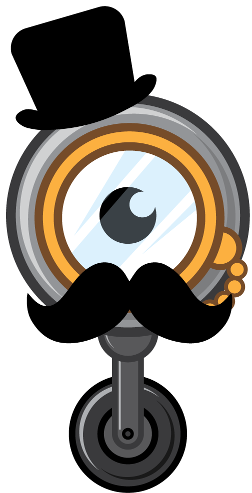
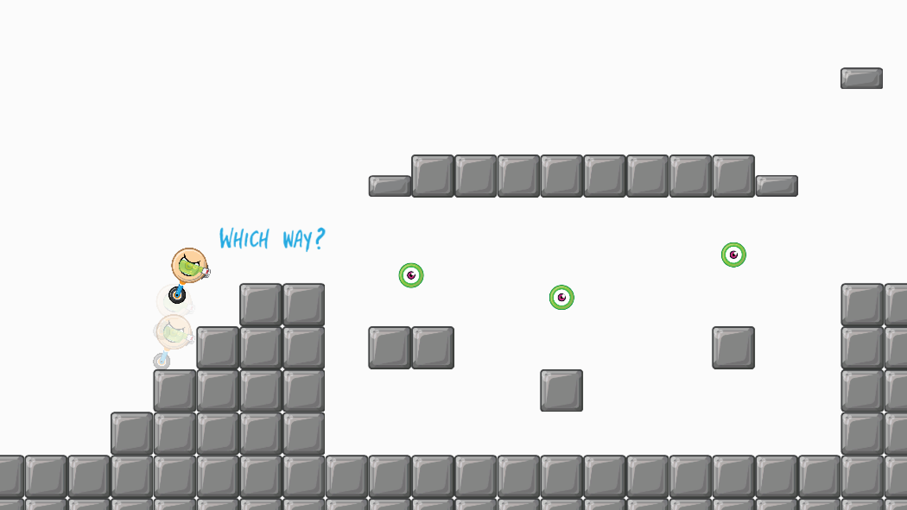
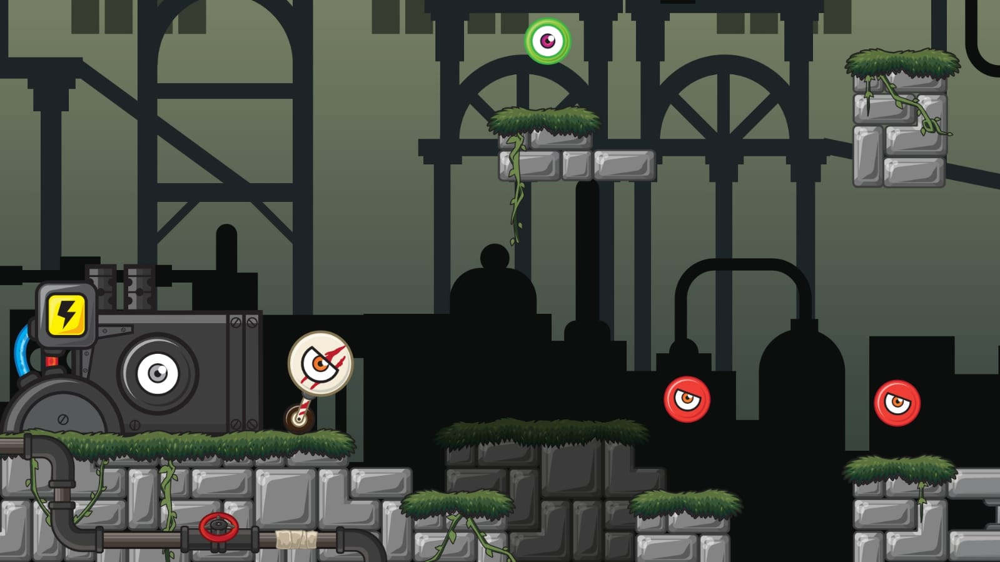

[Dreyever](https://github.com/Devilly/dreyever), pronounced the same as "driver", is a game currently in development. It's a 2D platform game focussing on dreyevers, little unicars (unicycles are one-wheeled bicycles, unicars are from this moment on one-wheeled cars).

E.g.

The game is being created by three people:

* me, Dennis van Oosterhout, for the coding
* Bas Goverde, of [Mr. X2 Studios](https://play.google.com/store/apps/developer?id=Mr.+X2+Studios), for the design
* [Jonathan Ramos](http://rufino.nl/) for the music and sounds

[Unity](https://unity3d.com/) is the game engine it's being developed in. The game will feature dozens of dreyevers, a lot of interactive elements in the environment, custom physics and simple yet challenging gameplay. One thing we find very important is that development will not stop once the game has been released. The gameplay will be perfected based on user experiences and content will be added on a regular basis.

Recently we switched to a new design which, for us, marks a new beginning for the project. We're getting more serious about it and that's one of the reasons we're starting this blog.

The old design was in the style shown in the image below (screenshot of gameplay ran within Unity).

Here is another image which shows the new style (early design reference image).

The old style was very clean and maybe also somewhat boring. To us it seems the new style fixes this. It still has a clean look but with a broader color palette and a lot more elements to entertain the eye.

Here's hoping this shift will come through in a good way once it gets implemented in the game.