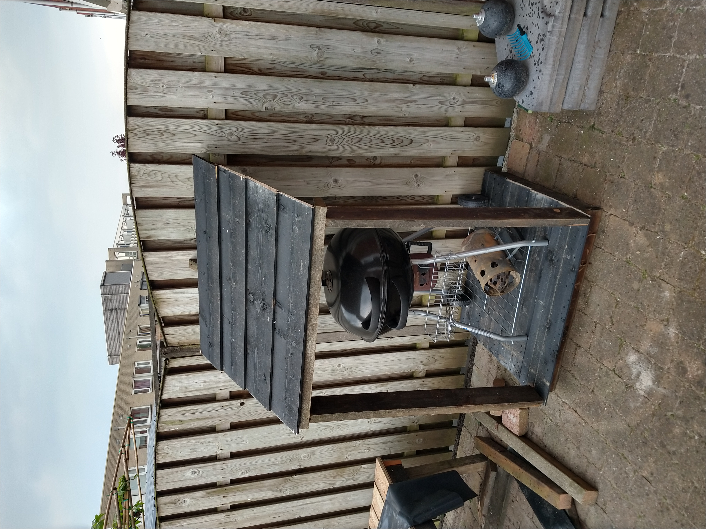

Our barbecue was stored in our cupboard under the stairs for a long time. But it used too much space and was clumsy to get outdoors. That why, two days ago, I took all the spare wood we had lying around and tried creating a small storage space for it outside.

And while I quite liked how it looked here the rain would just pour in from the sides. That is why I used some pond liner to fix that. (Also, in the above image a single plank is still missing from the roof, which would not help with keeping it dry either.)

Less beautiful, more functional!